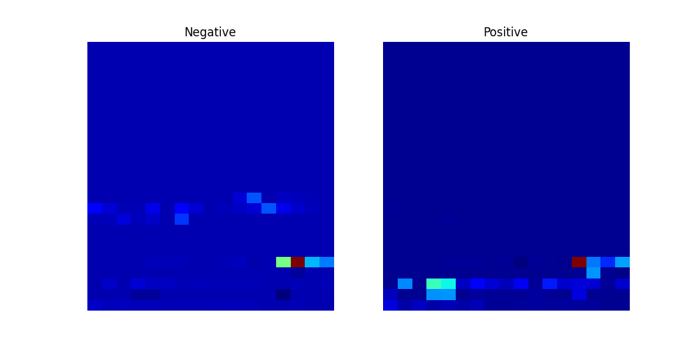
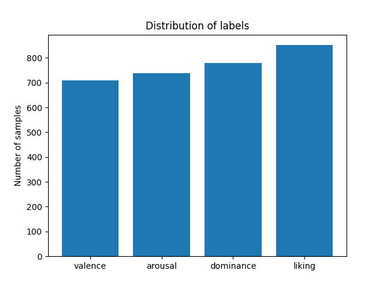
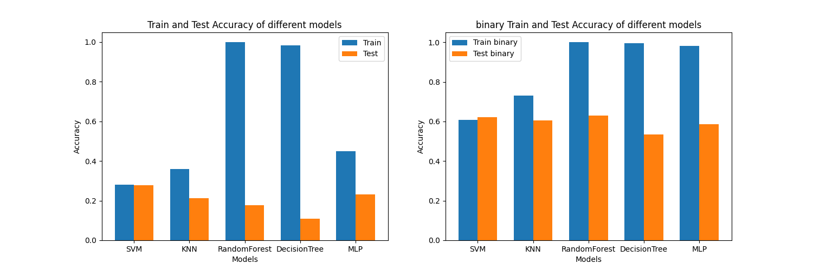

## 说明

**这是上海理工大学机器学习课程的期末大作业，供学弟学妹们参考，主要实现了使用5种机器学习算法进行情感识别**

## 文件说明

- **dataset/**: 包含数据集文件的目录。
- **processData/**: 包含数据处理脚本的目录。
- **data.png**: 数据样例图片。
- **labels.png**: 标签样例图片。
- **models.png**: 模型评估图片。
- **README.md**: 项目说明文件，介绍目录结构和各文件用途。
- **requirements.txt**: 列出了项目所需的Python依赖包。
- **save_data_to_csv.py**: 将数据保存为CSV格式的脚本。
- **show_data.py**: 用于显示数据的脚本。
- **train_data.csv**: 训练数据的CSV文件。
- **train_labels.csv**: 训练标签的CSV文件。
- **train_design_tree.py**: 用于训练决策树模型的脚本。
- **training_mlp.log**: 记录多层感知机模型训练过程的日志文件。
- **train_knn.py**: 用于训练K近邻（KNN）模型的脚本。
- **train_mlp.py**: 用于训练多层感知机（MLP）模型的脚本。
- **train_random_forest.py**: 用于训练随机森林模型的脚本。
- **train_svm.py**: 用于训练支持向量机（SVM）模型的脚本。
- **基于机器学习的情感识别模型设计.docx**: 项目的详细设计文档。

## 使用说明

1. **环境配置**: 
   - 安装所需的Python依赖包：`pip install -r requirements.txt`

2. **数据处理**:
   - 使用`save_data_to_csv.py`脚本将原始数据保存为CSV格式。
   - 使用`show_data.py`脚本查看和分析数据。

3. **模型训练**:
   - 运行`train_design_tree.py`训练决策树模型。
   - 运行`train_knn.py`训练K近邻模型。
   - 运行`train_mlp.py`训练多层感知机模型。
   - 运行`train_random_forest.py`训练随机森林模型。
   - 运行`train_svm.py`训练支持向量机模型。

4. **模型评估**:
   - 各训练脚本会输出训练集和测试集的准确度，并保存模型。

5. **详细设计**:
   - 参考`基于机器学习的情感识别模型设计.docx`文档获取项目的详细设计说明。

## 数据可视化

部分数据的可视化如下：

数据标签分布如下：

各个模型的表现效果如下：

## 联系方式

如有问题，请联系项目维护者。